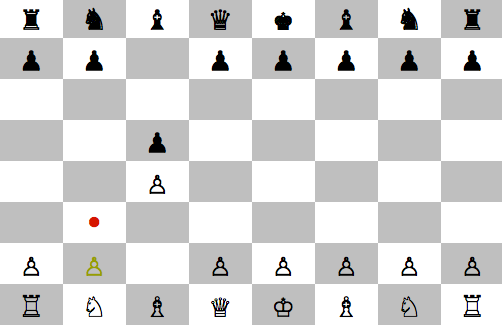

# Ruby Chess

# Instructions for playing

- To play, run 'ruby lib/game.rb' in command line!
- Use the arrow keys to scroll, and spacebar to select and place a piece.
- Hit 'control' + c to quit.

# To-Dos

- [] Alternate players and indicate current player
- [] Add AI Computer player
- [] Implement saving
